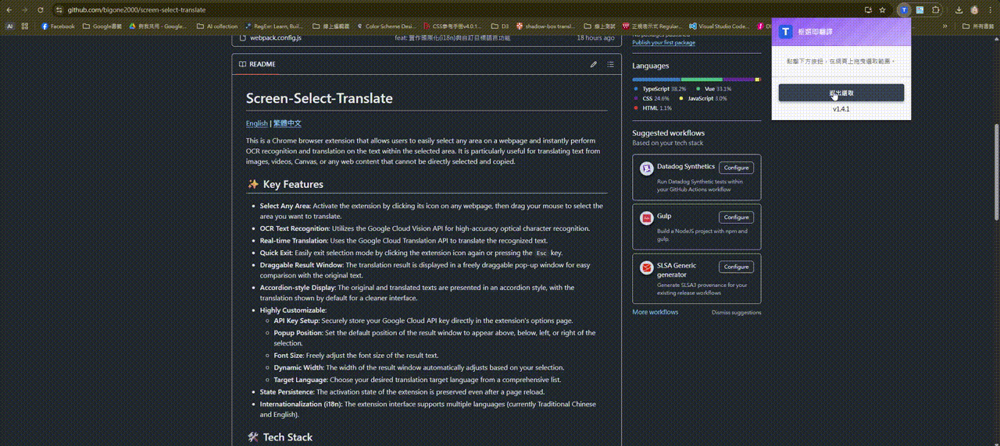

# Screen-Select-Translate

[English](./README.md) | [繁體中文](./README.zh-TW.md)

This is a Chrome browser extension that allows users to easily select any area on a webpage and instantly perform OCR recognition and translation on the text within the selected area. It is particularly useful for translating text from images, videos, Canvas, or any web content that cannot be directly selected and copied.

## ▶️ Demo

## ✨ Key Features

- **Select Any Area**: Activate the extension by clicking its icon on any webpage, then drag your mouse to select the area you want to translate.
- **OCR Text Recognition**: Utilizes the Google Cloud Vision API for high-accuracy optical character recognition.
- **Real-time Translation**: Uses the Google Cloud Translation API to translate the recognized text.
- **Quick Exit**: Easily exit selection mode by clicking the extension icon again or pressing the `Esc` key.
- **Draggable Result Window**: The translation result is displayed in a freely draggable pop-up window for easy comparison with the original text.
- **Accordion-style Display**: The original and translated texts are presented in an accordion style, with the translation shown by default for a cleaner interface.
- **Highly Customizable**:
  - **API Key Setup**: Securely store your Google Cloud API key directly in the extension's options page.
  - **Popup Position**: Set the default position of the result window to appear above, below, left, or right of the selection.
  - **Font Size**: Freely adjust the font size of the result text.
  - **Dynamic Width**: The width of the result window automatically adjusts based on your selection.
  - **Target Language**: Choose your desired translation target language from a comprehensive list.
- **State Persistence**: The activation state of the extension is preserved even after a page reload.
- **Internationalization (i18n)**: The extension interface supports multiple languages (currently Traditional Chinese and English).

## 🛠️ Tech Stack

- **Framework**: [Vue 3](https://vuejs.org/)
- **Build Tool**: [Webpack](https://webpack.js.org/)
- **Language**: [TypeScript](https://www.typescriptlang.org/)
- **APIs**: Google Cloud Vision & Translation API

## 🚀 Installation and Usage

### 1. Get the Project

```bash
git clone https://github.com/bigone2000/screen-select-translate.git
cd screen-select-translate
```

### 2. Install Dependencies

This project uses `npm` as its package manager.

```bash
npm install
```

### 3. Build the Project

```bash
npm run build
```

This command will generate a `dist` folder in the project's root directory.

### 4. Load the Extension in Chrome

1.  Open Chrome and navigate to `chrome://extensions`.
2.  Enable "Developer mode" in the top right corner.
3.  Click "Load unpacked".
4.  Select the newly generated `dist` folder.
5.  You should now see the "Screen-Select-Translate" icon in your browser's toolbar.

### 5. Set Up Your API Key

This extension requires your own Google Cloud API key to use the OCR and translation features. Please follow these steps to obtain one:

#### A. Get a Google Cloud API Key

1.  **Create/Select a Google Cloud Project**
    *   Go to the [Google Cloud Console](https://console.cloud.google.com/) and log in to your Google account.
    *   If you don't have a project, click the project menu at the top of the page and select "New Project". Name your project and click "Create".

2.  **Enable Billing for Your Project**
    *   The Vision API and Translation API are paid services (though they offer a free tier). You must enable billing for your project.
    *   In the left navigation menu, go to "Billing" and link your project to a valid billing account.

3.  **Enable the Vision and Translation APIs**
    *   In the left navigation menu, go to "APIs & Services" > "Library".
    *   Search for `Cloud Vision API`, select it, and click "Enable".
    *   Return to the "Library", search for `Cloud Translation API`, select it, and click "Enable".

4.  **Create an API Key**
    *   In the left navigation menu, go to "APIs & Services" > "Credentials".
    *   Click "+ CREATE CREDENTIALS" at the top of the page and select "API key".
    *   Your API key will be generated. **Copy** this key immediately.

5.  **Restrict the Key for Security (Strongly Recommended)**
    *   In the API key creation pop-up, click "EDIT API KEY" (or find your key in the credentials list and click the edit icon).
    *   Under "Application restrictions", select "Websites".
    *   Under "Website restrictions", click "ADD" and enter `chrome-extension://<your-extension-id>/*`, where `<your-extension-id>` is your extension's ID (found on the `chrome://extensions` page).
    *   Under "API restrictions", select "Restrict key".
    *   In the "Select APIs" dropdown below, check only `Cloud Vision API` and `Cloud Translation API`.
    *   Click "Save". This ensures your key can only be used for these two services, preventing abuse.

#### B. Save the Key to the Extension

1.  In the Chrome toolbar, **right-click** the "Screen-Select-Translate" icon and click "**Options**".
2.  On the options page that opens, paste the Google Cloud API key you just copied into the input field.
3.  Click "Save".

After making code changes, you will typically need to click the "Reload" button on the `chrome://extensions` page to see your changes take effect.